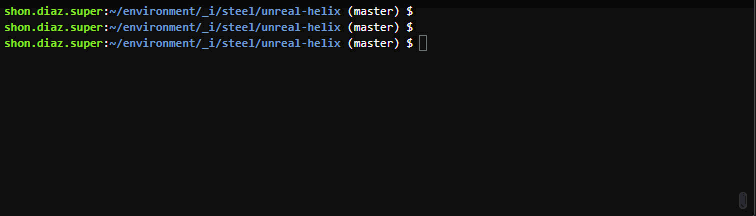

# unreal-helix
We wanted a managed version control solution with simple pricing, but such a thing didn't exist.
Therefore we will have to stand up our own service to handle this at a reasonable price we can afford.

## Why
We originally used the excellent Plastic SCM, which was a no brainer solution for game dev asset version control.
Plastic SCM had a very easy-to-use hosted service as well as a great local client interface.
At some point, Unity3D bought Plastic SCM, and while the service is still excellent locally, their rebranded website is terrible.
I can never find where my code is on their site. Visiting `plasticscm.com` redirects me to the "unity devops" marketing page.
This concerns me. I am concerned that we might someday need to migrate off this tool like we did for Unity3D's game engine side.

Now that we are using Unreal Engine, we could take advantage of their tighter integration with perforce/helix.
By using aws reserved instances, we can spend about $3 a month for a centrally hosted version control server.


## Estimated Costs _($5 per month)_
AWS charges per use of network, static IPs, storage, compute, and other minor items like dns route lookups and api calls.
For the most part, these uses stay within free limit, but some are expected to go over the free limits.

[$93 upfront for 36 months of reserved t3a.micro](https://aws.amazon.com/ec2/pricing/reserved-instances/getting-started/)  
[$2.40 monthly for 30GB of gp3 class storage for the server](https://calculator.aws/#/addService/EBS)

```
179.40 == (2.40 * 36) + 93
179.40 == 86.4 + 93
($4.98 monthly for 36 months)
```
By using reserved instances, we can get a nice discount. This is a commitment to have the server for 3 years.
For SteelPinion this isn't a conern, but your situation may not be similar.


## Initial setup of server
**AFTER** you've got an AWS account
on an _ubuntu or mac_ machine run the following

```
git clone git@github.com:steel-pinion/unreal-helix.git
cd unreal-helix

make prepare ENV=prod
touch -p config/secrets-prod.env
* (STOP: fill with valid secrets described below, then continue)
```

```
make build deploy TARGET=dependencies ENV=prod
make build deploy TARGET=helix ENV=prod
* (type 'yes' when prompted)
```



### Making a `secrets-prod.env`
The file is very small, and **not saved to version control**.
I have already set up the `.gitignore` to block accidental upload of this file.

One needs to create an AWS account.
This is technically **not free**, but it is highly affordable.
[AWS gives an entirely new account **a free year** for either `t2.micro` and/or `t3.micro` server.](https://aws.amazon.com/free/?all-free-tier.sort-by=item.additionalFields.SortRank&all-free-tier.sort-order=asc&awsf.Free%20Tier%20Types=*all&awsf.Free%20Tier%20Categories=*all).
_Light research can be done to decide if you are okay with the costs._

One needs to create a public/private key pair to secure access to this new server.
```
ssh-keygen -t rsa -b 4096 -C "myUniqueUserName@unreal-helix" -P "" -f helix
cat ./helix.pub
* (take contents of helix.pub and place in secrets-prod.env -> TF_VAR_helix_pub_key="contents in quotes")
```

Your file will end up looking like this:
```
export AWS_ACCESS_KEY_ID=AAAAAAAAAA...
export AWS_SECRET_ACCESS_KEY=BBBBBBBBBBBB...
export AWS_DEFAULT_REGION=us-east-1
export TF_VAR_helix_pub_key="ssh-rsa AAAAB3Nz..."
```


-----------------------------------
# Configuring Perforce/Helix Server
These steps could be further automated by placing them into an `ansible` setup,
but for now, lets discover what steps exist.

[log into the ec2 console to see the new public IP address](https://us-east-1.console.aws.amazon.com/ec2/home?region=us-east-1#Instances:)

```
* (NOTE: your IP address will be different than the below)
ssh -i ./helix ubuntu@22.216.143.99
```

```
wget https://package.perforce.com/perforce.pubkey
gpg -n --import --import-options import-show perforce.pubkey
gpg -n --import --import-options import-show perforce.pubkey | grep -q "E58131C0AEA7B082C6DC4C937123CB760FF18869" && echo "true"
wget -qO - https://package.perforce.com/perforce.pubkey | sudo apt-key add -

sudo nano /etc/apt/sources.list.d/perforce.list
* (paste in the following line and save the file)
deb http://package.perforce.com/apt/ubuntu focal release
```

```
sudo apt-get update
sudo apt-get install helix-p4d
sudo /opt/perforce/sbin/configure-helix-p4d.sh
* (run through questions with defaults, except create a unique admin user as prompted)
```

Now we have an **UNSAFE** perforce server!
[Securing it per the recommened docs is advisable.](https://www.perforce.com/manuals/p4sag/Content/P4SAG/chapter.security.html#Recommen)

```
p4 configure set dm.user.setinitialpasswd=0
p4 configure set security=2
p4 configure set dm.user.noautocreate=2
p4 configure set dm.info.hide=1
p4 configure set run.users.authorize=1
p4 configure set dm.keys.hide=2
p4 configure show
* (confirm your settings with a quick look)
* (ensure you see P4PORT=ssl:1666 (serverid) listed near the top)
```

[_(newer versions of perforce should have this setup by default so that we no longer need to manually setup certs)_](https://cb-productions.github.io/PerforceGuideUE4/)
confirm the ssl certs are pregenerated
```
sudo ls /opt/perforce/servers/master/root/ssl
```

create some users for the team
```
p4 user -f stitcher-alpha
p4 user -f bacon-maker
* (will be taken to a text editor where you can specify email address)
p4 passwd stitcher-alpha
p4 passwd bacon-maker
* (passwd command(s) will prompt you)
```

Setup Unreal typemaps
```
p4 typemap

* (add the following at the bottom)
```

```
    binary+w //depot/....exe
    binary+w //depot/....dll
    binary+w //depot/....lib
    binary+w //depot/....app
    binary+w //depot/....dylib
    binary+w //depot/....stub
    binary+w //depot/....ipa
    binary //depot/....bmp
    text //depot/....ini
    text //depot/....config
    text //depot/....cpp
    text //depot/....h
    text //depot/....c
    text //depot/....cs
    text //depot/....m
    text //depot/....mm
    text //depot/....py
    binary+l //depot/....uasset
    binary+l //depot/....umap
    binary+l //depot/....upk
    binary+l //depot/....udk
    binary+l //depot/....ubulk
```


## Connect Unreal Client
This part was the most confusing since the unreal editor doesn't hold your hand if you want a secure connection.
[The docs at unreal, inform you that you need the perforce client in order to both initialize or download an exisiting project.](https://docs.unrealengine.com/5.0/en-US/using-perforce-as-source-control-for-unreal-engine/)

This devlog video explains the subject lightly, though its not an exhaustive walkthrough.
https://youtu.be/Cxfw18HtJ2I


--------------------------
## Redeploy Server Changes
**Warning: the EBS volume is configured to NOT erase so that source-code is never lost on accident.**
You will have to manually erase an EBS volume if you know what you are doing.
This is so that if you need to destroy only the server to change server level settings _(like public IP or performance)_ , the data is retained.
Restoring the data should be possible in several ways in such a scenario.
The most cost effective being to [set `infra/helix.tf::aws_instance~root_block_device.volume_id`](https://registry.terraform.io/providers/hashicorp/aws/latest/docs/resources/instance#volume_id).

The nature of this repo doesn't actually make much use of the idempotent setup,
however, if there are changes to any of the configuration as seen in `./infra/*`,
then those changes can be released with the following commands:

```
* (change stuff)
make install
make build deploy TARGET=dependencies ENV=prod
make build deploy TARGET=helix ENV=prod
* (type yes when prompted)
```


## Potential Errors and their fix
```
Error: Backend configuration changed 
A change in the backend configuration has been detected, which may require migrating existing state.
If you wish to attempt automatic migration of the state, use "terraform init -migrate-state".
If you wish to store the current configuration with no changes to the state, use "terraform init -reconfigure".

/*** How to fix ***/
delete the .terraform folder cache. It likely has specific references to another env tfstate bucket in the problematic infra folder
ex: infra/helix/.terraform
```
